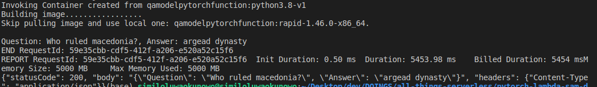
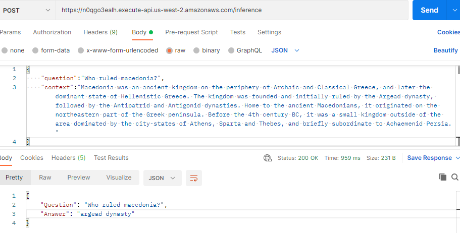

# pytorch-lambda-sam-demo

This project contains source code for the deployment of a pre-trained pytorch QA model, using the SAM CLI, AWS Lambda, ECR etc.

- src- Code for the application's Lambda function.
- events - Invocation events that you can use to invoke the function.
- tests - Unit tests for the application code. 
- template.yaml - A template that defines the application's AWS resources.

The application uses several AWS resources, including Lambda functions and an API Gateway API. These resources are defined in the `template.yaml` file in this project. You can update the template to add AWS resources through the same deployment process that updates your application code.

## Getting started 

>Make sure you have the AWS SAM CLI and Docker installed on your computer.

## Initialize a new application 

```bash
$ sam init 
```
*Select the python3.x runtime and HelloWorld function template.

## Build 

```bash
$ sam build 
```

## Deployment 

```bash 
$ sam deploy --guided
```

## Testing Locally

```bash
$ sam local invoke QAModelPytorchFunction -e events/event.json 
```
**Local Invocation Response**


## Testing via Postman 


## Unit Tests

Tests are defined in the `tests` folder in this project. Use PIP to install the test dependencies and run tests.

## Cleanup

To delete the sample application that you created, use the AWS CLI. Assuming you used your project name for the stack name, you can run the following:

```bash
aws cloudformation delete-stack --stack-name pytorch-lambda-sam-demo
```

## Resources

See the [AWS SAM developer guide](https://docs.aws.amazon.com/serverless-application-model/latest/developerguide/what-is-sam.html) for an introduction to SAM specification, the SAM CLI, and serverless application concepts.

Next, you can use AWS Serverless Application Repository to deploy ready to use Apps that go beyond hello world samples and learn how authors developed their applications: [AWS Serverless Application Repository main page](https://aws.amazon.com/serverless/serverlessrepo/)
